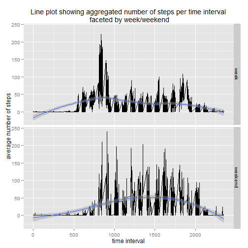

##Step 1: Load libraries, Set up folder and obtain data set 

###Load libraries
the libraries and packages required for this analysis are loaded below.


package test function, checks to see if a package has been installed and loads it, if the pakage has not been installed then it installs and loads. the function was adapted from a solution provided by Sacha EpsKamp on [Stackexchange](http://stackoverflow.com/questions/9341635/how-can-i-check-for-installed-r-packages-before-running-install-packages)


```r
pkgTest <- function(x)
  {
    for (i in 1:length(x)) {
      if (!require(x[i],character.only = TRUE))
      {
        install.packages(x[i],dep=TRUE)
          if(!require(x[i],character.only = TRUE)) stop("Package not found")
      }
    }
  }
```
Check for packages load as required

```r
packages <- c("ggplot2","reshape2", "plyr")

pkgTest(packages)
```


```r
#This code chunk is to ensure that the computer can always navigate back to the start folder, it also avoids things like accidently nesting several files sturctures
if (!exists("basewd")){
  basewd <-getwd()  
  setwd(basewd)
  }  else {setwd(basewd)}
```


###Create project folder Structure.


```r
# The folder structure for the project had to be created programmtically due to conflict between R and the security system on the newtwork I am using. However a folder structure generator is a pretty cool thing to have anyway.

ProjectName <- "Assessment 1"
projstrct <- function(ProjectName = "NewProject") {
  mdat <- matrix(c("Code","Data","Figures","Output", "Raw","Raw","Exploratory", "Exploratory",  "Clean","Clean","Final", "Final" ), nrow = 4, ncol = 3, byrow = FALSE)

  for (n in 2:3){
    for ( i in 1:4){
      dir.create(file.path(getwd(),ProjectName,mdat[i,1],mdat[i,n]), recursive = TRUE)
    }
  }
}

projstrct(ProjectName)
```

```
## Warning: 'C:\Users\RSTUDIO\Documents\Assessment 1\Code\Raw\Assessment 1\Code\Raw' already exists
## Warning: 'C:\Users\RSTUDIO\Documents\Assessment 1\Code\Raw\Assessment 1\Data\Raw' already exists
## Warning: 'C:\Users\RSTUDIO\Documents\Assessment 1\Code\Raw\Assessment 1\Figures\Exploratory' already exists
## Warning: 'C:\Users\RSTUDIO\Documents\Assessment 1\Code\Raw\Assessment 1\Output\Exploratory' already exists
## Warning: 'C:\Users\RSTUDIO\Documents\Assessment 1\Code\Raw\Assessment 1\Code\Clean' already exists
## Warning: 'C:\Users\RSTUDIO\Documents\Assessment 1\Code\Raw\Assessment 1\Data\Clean' already exists
## Warning: 'C:\Users\RSTUDIO\Documents\Assessment 1\Code\Raw\Assessment 1\Figures\Final' already exists
## Warning: 'C:\Users\RSTUDIO\Documents\Assessment 1\Code\Raw\Assessment 1\Output\Final' already exists
```

###Download data set


```r
# The next two code chnks both require the same file path however they the file that downloads the zip may be set to eval = FALSE to avoid problems when knitting.
setwd(file.path(basewd,ProjectName, "Data", "Raw"))
```


```r
#This code chunk checks the raw data folder to see if the file is already present if not it downloads it from the coursera website and unzips it ready for use. As the file is a niary the option mode="wb" should be used also knitry doesn't like https so http was used instead

if (file.exists("repdata-data-activity.zip") == FALSE){
  url <- "http://d396qusza40orc.cloudfront.net/repdata%2Fdata%2Factivity.zip"
  download.file(url, "repdata-data-activity.zip", mode="wb")
    unzip("repdata-data-activity.zip")

}
```

##Loading and preprocessing the data

The data is in tidy format the variables are have acceptable names, however the date variable is miss-classed as a factor, and need to be corrected.

```r
data <- read.csv("activity.csv")
summary(data)
```

```
##      steps               date          interval   
##  Min.   :  0.0   2012-10-01:  288   Min.   :   0  
##  1st Qu.:  0.0   2012-10-02:  288   1st Qu.: 589  
##  Median :  0.0   2012-10-03:  288   Median :1178  
##  Mean   : 37.4   2012-10-04:  288   Mean   :1178  
##  3rd Qu.: 12.0   2012-10-05:  288   3rd Qu.:1766  
##  Max.   :806.0   2012-10-06:  288   Max.   :2355  
##  NA's   :2304    (Other)   :15840
```

```r
sapply(data, class)         #returns the class of every column in the data set
```

```
##     steps      date  interval 
## "integer"  "factor" "integer"
```

```r
incom <- sum(!complete.cases(data))  #how many rows of data contained NA's
data[,2]<- as.Date(data[,2])
summary(data)
```

```
##      steps            date               interval   
##  Min.   :  0.0   Min.   :2012-10-01   Min.   :   0  
##  1st Qu.:  0.0   1st Qu.:2012-10-16   1st Qu.: 589  
##  Median :  0.0   Median :2012-10-31   Median :1178  
##  Mean   : 37.4   Mean   :2012-10-31   Mean   :1178  
##  3rd Qu.: 12.0   3rd Qu.:2012-11-15   3rd Qu.:1766  
##  Max.   :806.0   Max.   :2012-11-30   Max.   :2355  
##  NA's   :2304
```
of the 17568 rows of data in the data set 2304 had Na's leading them to be incomplete

##What is the total number of steps taken per day


```r
#A histogram showing the total number of steps taken each day
ggplot(data,aes(x=date, y = steps))+geom_histogram(stat = "identity")+ggtitle("Total number fo steps taken each day")+ xlab("Day")+ylab("Number of steps")
```

```
## Warning: Removed 2304 rows containing missing values (position_stack).
```

 
The above figure shows a histogram of how many steps were taken each day across the trial period


```r
#calculating mean and median steps per day

stepsday <- aggregate(steps ~date, data, sum)
mu <- mean(stepsday[,2])
med <- median(stepsday[,2])
```

During the trial period the mean number of steps taken per day was 1.0766 &times; 10<sup>4</sup> and the median number of steps was 10765. the similarity of these two averages suggests that the data distribution is not skewed.

##What is the average daily activity pattern


```r
#create a dataframe of median and mean averages for each time interval
interval.mean <- aggregate(steps ~ interval, data, mean)
interval.median <- aggregate(steps ~ interval, data, median)
interval <- merge(interval.mean, interval.median, by = "interval")
colnames(interval) <- c("Interval", "Mean", "Median")
interval <- melt(data = interval, measure.vars= c("Mean","Median"), variable.name = "Average", value.name="steps" )

ggplot(interval, aes(x=Interval, y=steps, colour=Average))+geom_line()+ggtitle("Average number of steps per time interval")+xlab("Time Interval")+ylab("Average Steps")
```

 


```r
#find the maximum number of avergage steps taken in the time period.
mean.max <- max(interval[interval[,2]=="Mean",3])
median.max <- max(interval[interval[,2]=="Median",3])

int.mean.max <-  interval[interval[,3]==mean.max & interval[,2]== "Mean",1]
int.median.max <- interval[interval[,3]==median.max & interval[,2]== "Median",1]
```

There was a large difference between the maximum steps per minute during the trial period for mean and median suggestion that the data is skewed. the mean peaked at 206.1698 steps per 5 minute interval  whilst the median peaked at 60 steps per five minute interval. Both of the averages peaked at approximately the same time mean peaked at 835am and median peaked slightly later at 845am


##Imputing missing values

The total number of rows with missing values is 2304 which is 13.1148/% of the total data set.

A suitable imputation method is to replace the NA values with the mean value for that 5 minute period.


```r
#create a new data set which subsitutes missing data for the mean of that interaval
#function taken from (How to replace NA with mean)[http://stackoverflow.com/questions/9322773/how-to-replace-na-with-mean-by-subset-in-r-impute-with-plyr]
data.impute <- cbind(data, as.numeric(rownames(data)))
impute.mean <- function(x) replace(x, is.na(x), mean(x, na.rm = TRUE))
data.impute <- ddply(data.impute, ~ interval, transform, steps = impute.mean(steps))
data.impute <-data.impute[order(data.impute[,4]),][,-4]
```


```r
#A histogram showing the total number of steps taken each day
ggplot(data.impute,aes(x=date, y = steps))+geom_histogram(stat = "identity")+ggtitle("Total number fo steps taken each day: NA values imputed")+ xlab("Day")+ylab("Number of steps")
```

 


```r
#calculating mean and median steps per day

stepsday <- aggregate(steps ~date, data.impute, sum)
mu2 <- mean(stepsday[,2])
med2 <- median(stepsday[,2])
```

After imputing the missing data the imputed mean is 1.0766 &times; 10<sup>4</sup> and the imputed median is 1.0766 &times; 10<sup>4</sup> which is essentailly the same as before the values were imputed.Imputing the values using this technique **does not** have any effect on the overall value.

##Are there differences in activity patterns between weekdays and weekends?


```r
#mark days of the week as either week days or weekends

data[,4] <- weekdays(data[,2])
weekend <- data[,4]==c("lørdag","søndag")
data[weekend,4] <- "weekend"
data[!weekend,4] <- "week"
```


```r
interval.mu.week <- aggregate(steps ~ interval +V4, data, mean)
interval.med.week <- aggregate(steps ~ interval +V4, data, median)
interval.week <- merge(interval.mu.week, interval.med.week, by = c("interval", "V4"))
colnames(interval.week) <- c("Interval", "Week","Mean", "Median")
interval.week <- melt(interval.week, measure.vars =c("Mean", "Median"), variable.name ="Average", value.name="Steps")
```


```r
#Create faceted time series graph showing the difference between behaviour at the week and weekend 
ggplot(interval.week, aes(x=Interval, y=Steps)) + geom_line() + facet_grid(Week~.)+geom_smooth()+ggtitle("Line plot showing aggregated number of steps per time interval/n faceted by week/weekend")+xlab("time interval") + ylab("average number of steps")
```

```
## geom_smooth: method="auto" and size of largest group is <1000, so using loess. Use 'method = x' to change the smoothing method.
## geom_smooth: method="auto" and size of largest group is <1000, so using loess. Use 'method = x' to change the smoothing method.
```

 

When comparing week to weenend walking patterns we see that the number of steps per time interval peaks in the morning during rush hour and is lower during the middle of the day when everybody is a work, this contrasts with the weekend pattern that starts later is more evenly spread out through the day with more of a peak at the end of the day.
The graph shows that the steps are more evenly spread out during the weekends with a peak coming
